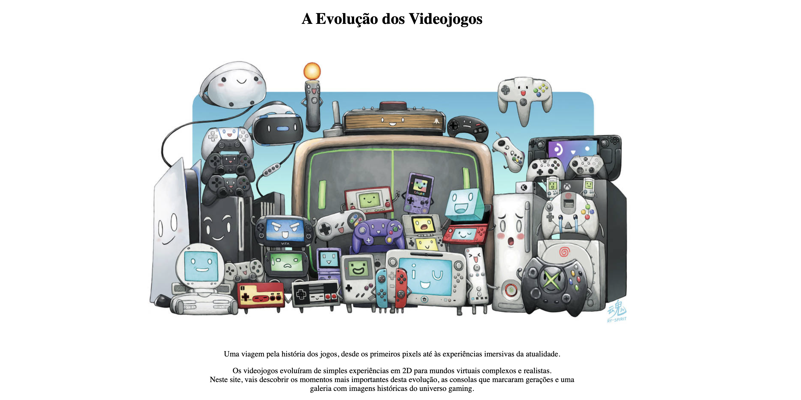
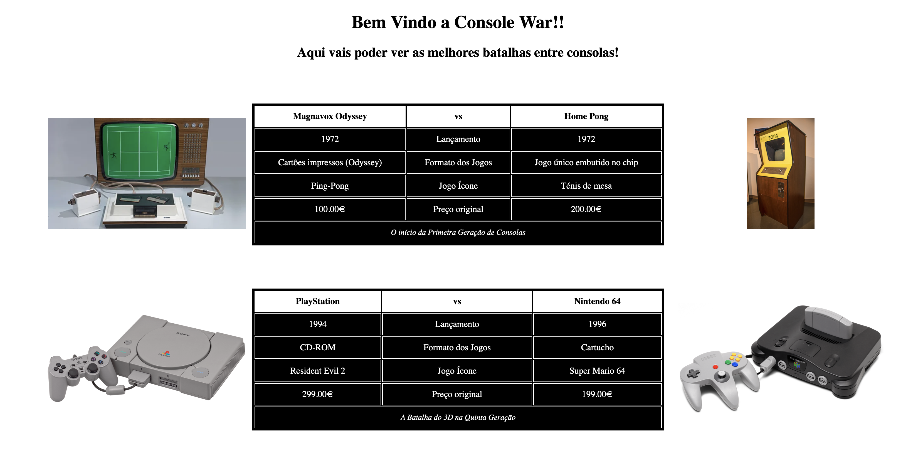

## Gaming Evolution

Repositório para alojar o projeto desenvolvido para a unidade curricular de **Tecnologias Internet**, uma disciplina de 1º ano na **Universidade da Maia**. 
Desenvolvido pelo Grupo **inf25tig03**: [@OFabioBrioso99](https://github.com/FabioBrioso99), [@User-Do-Colega](https://github.com/User-Do-Colega) e [@User-Do-Colega](https://github.com/User-Do-Colega).

## Pequena Descrição do Trabalho

Este projeto consiste no desenvolvimento de uma aplicação web dedicada à evolução dos jogos, a qual foi dividida por 4 páginas (Home, Linha do tempo, Galeria e Console War). Na Home, optámos por fazer uma página onde dê para aceder a todas as restantes páginas; nesta colocámos curiosidades, alguns atalhos, easter eggs, entre outras coisas, decidindo colocar algo simples e direto. Na página Linha do Tempo, bem como o seu nome indica, a parte principal é um script criado em JavaScript onde dá para ver a evolução do gaming durante alguns anos. De seguida temos a Console War onde, com tabelas, conseguimos comparar a concorrência ao longo dos anos entre consolas e os seus detalhes, apresentando um facto curioso na última. E por último, mas não menos importante, uma Galeria onde mostramos coisas absurdas e momentos icónicos do gaming feitos pela comunidade.

---

## Repository organization

Abaixo encontras a organização das pastas deste repositório para facilitar a navegação:
* **Pasta Principal:** Tudo ficou armazenado na pasta principal do repositório (`Trabalho_final`).
* **Código fonte:** O código do projeto está na pasta [src folder](./src).
* **Documentação:** Os relatórios e capítulos estão na pasta [doc folder](./doc).

---

## Galeria

Aqui podes ver algumas capturas de ecrã do projeto em funcionamento:

| Página Inicial | Console War |
| :---: | :---: |
|  |  |

---

## Tecnologias Usadas

As tecnologias base utilizadas no desenvolvimento deste projeto foram:

* [HTML5](https://developer.mozilla.org/pt-BR/docs/Web/HTML) - Estruturação das páginas web.
* [CSS3](https://developer.mozilla.org/pt-BR/docs/Web/CSS) - Estilização e design responsivo.
* [JavaScript](https://developer.mozilla.org/pt-BR/docs/Web/JavaScript) - Lógica e interatividade do lado do cliente.
* [XML](https://aws.amazon.com/pt/what-is/xml/) - Armazenamento/estruturação de dados.
* [XSD](https://support.microsoft.com/pt-PT/Excel/xml-schema-definition-xsd-data-type-support) - Validação do XML.
* [Formspree](https://formspree.io) - Questionario sem qualquer tipo de base de dados.
---

## Frameworks e Bibliotecas

Para auxiliar no desenvolvimento, utilizámos as seguintes ferramentas:

* [Google Gemini](https://gemini.google.com/app?hl=pt) - Para ajudar a criar o JavaScript e tirar algumas dúvidas.

---

## Relatório

O relatório do projeto encontra-se dividido nos seguintes capítulos:

* **Chapter 1:** [Project presentation](./doc/capitulo1.md)
* **Chapter 2:** [User Interface Prototype and Sitemap](./doc/capitulo2.md)
* **Chapter 3:** [Product](./doc/capitulo3.md)
* **Chapter 4:** [Presentation](./doc/capitulo4.md)

---

## Equipa

* **Fábio Santos** - [@OFabioBrioso99](https://github.com/FabioBrioso99)
* **Rodrigo Linhas** - [@RodrigoLinhas2007](https://github.com/RodrigoLinhas2007)
* **Francisco Dantas** - [@Fozeiro4470](https://github.com/Fozeiro4470)