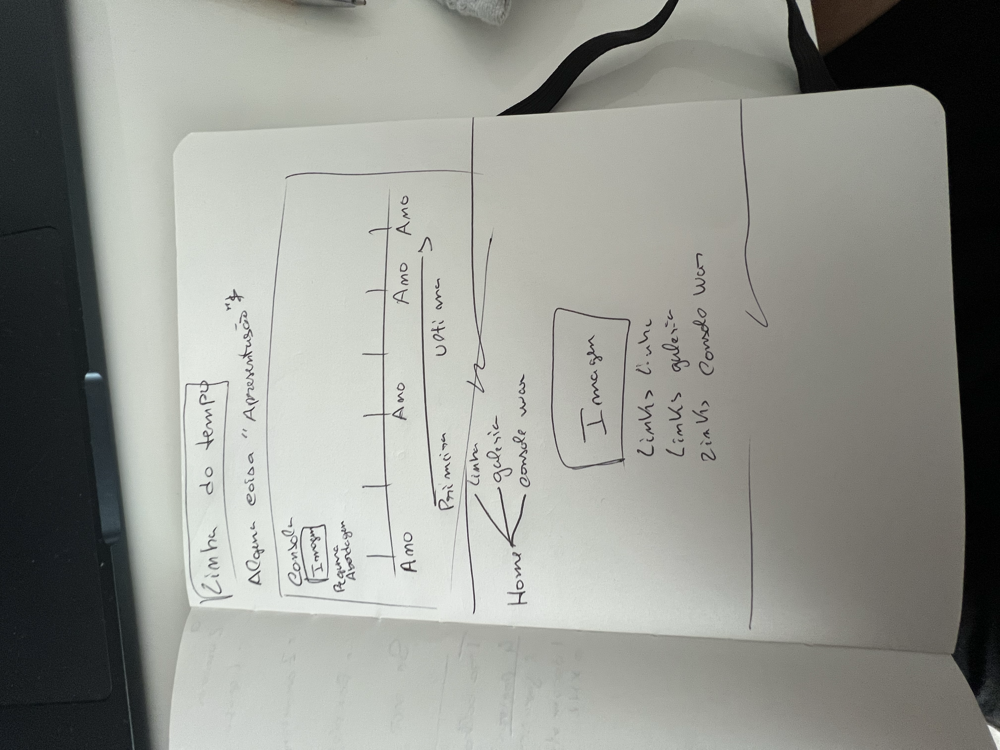
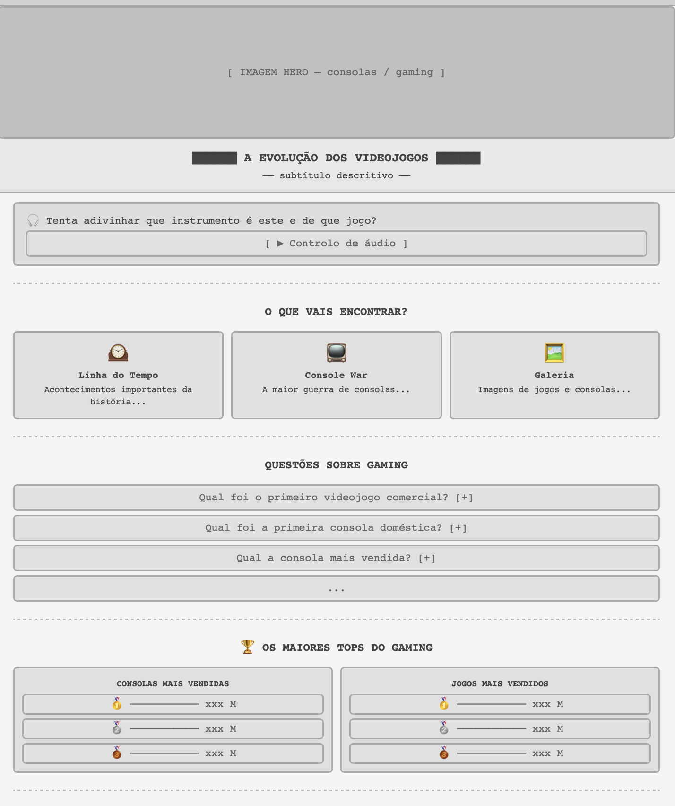
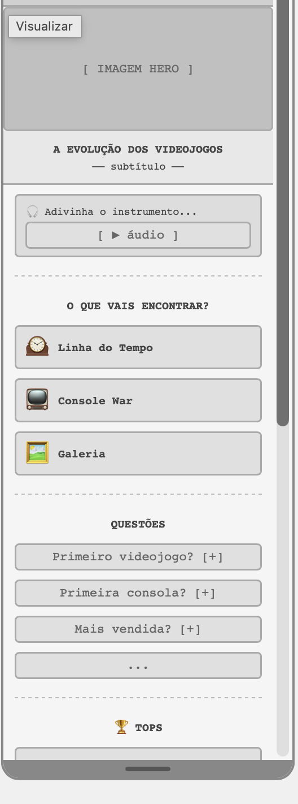
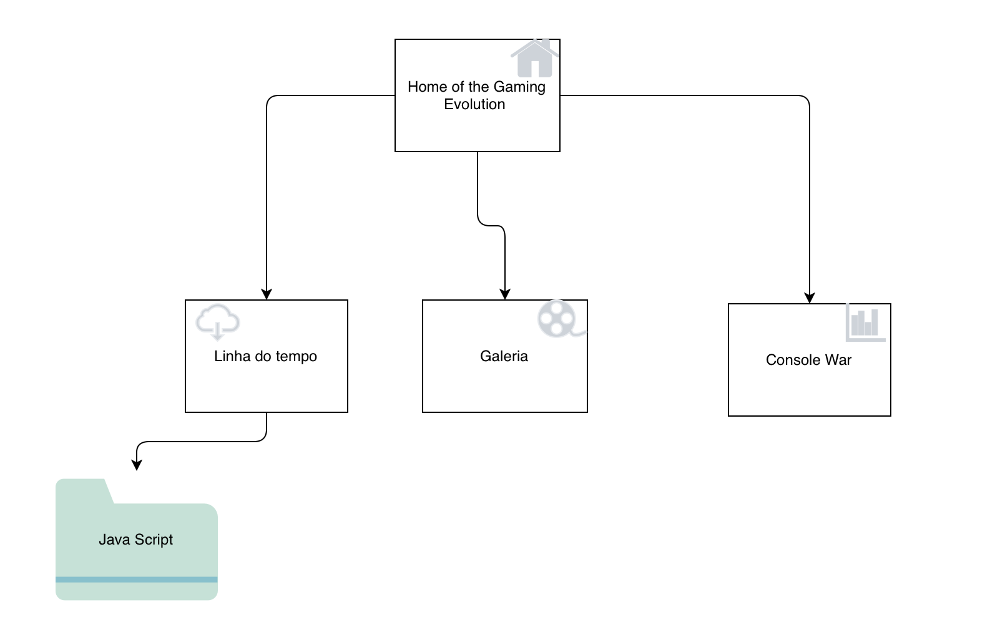

# C2 : User Interface

## Organização da Informação e Responsividade

O nosso website foi estruturado com o objetivo de guiar o utilizador de forma intuitiva através da história do *gaming*. A informação está organizada de forma cronológica e temática, dividida em quatro páginas principais: a Página Principal (âncora e introdução), a Linha do Tempo (evolução técnica das consolas), a Console War (comparação geracional) e a Galeria (impacto cultural e momentos icónicos).

### Abordagem Mobile e Impressora 
No desenvolvimento da interface, adotámos uma abordagem baseada nos princípios de **Mobile** e de **Impressao**. Desenhámos a estrutura a pensar  nas limitações e na fluidez dos ecrãs dos dispositivos móveis (smartphones) e de caso alguem queira imprimir a nossa pagina passando tudo para preto e branco para melhorar a impressao e a poupança de tinteiros bem como nos videos nao aprecer nada pois nao da para imprimir videos. 

Garantimos que todos os elementos, como as tabelas de "tops", o sistema de questionário e o acordeão de curiosidades (`
` e `
`), se empilham verticalmente em ecrãs mais pequenos. Através do uso de CSS e *Media Queries*, o site adapta-se e expande-se dinamicamente quando visualizado em tablets ou computadores, assegurando uma experiência totalmente responsiva e sem perda de usabilidade.

---

## Interface and Common features

### Sketchs

*Abaixo encontra-se os esboços inicial desenhado à mão durante a fase de 'construção' do projeto.*

| Esboço |
| :---: | :---: |
|  | 
| **Figura 1:** Esboço inicial à mão para idealizar a disposição e estrutura da Linha do tempo e da Página Principal. |

---

### Wireframes

*De seguida, apresenta-se o protótipo digital (wireframe) que serviu de guia para a programação do layout final.*

---

### Sitemap (Mapa do Site)

*O seguinte diagrama ilustra a arquitetura de informação do website, demonstrando a hierarquia e a navegação entre a página principal e as restantes páginas secundárias.*

---
| | | |
| :---: | :---: | :---: |
| [< Previous](./capitulo1.md) | [^ Main](../README.md) | [Next >](./capitulo3.md) |